# LibraryManagementSystem
--------------------------
* In this project main we have to deal with three sections
  ## frontend_image
  ## backend
    * ### books
    * ### users
## What has to do?
* In this we have to do following things
  * build docker image
  * run trivy scan for docker image
  * publish trivy scan reports  
  * push the image to docker hub
* We have two approaches for doing this 
  * Manual 
  * Write azure pipeline
## Manual
* Clone git repository into the instance

### Install docker
```sh
curl -fsSL https://get.docker.com -o install-docker.sh
docker --version
```
* Add the user to docker group through following command
```  
sudo usermod -aG docker ubuntu
exit 
```
* 
* Clone the repository into your machine.

### Install Trivy
* Install trivy to scan docker images
* Execute the following commands 
```sh
sudo apt-get install -y wget
wget https://github.com/aquasecurity/trivy/releases/download/v0.34.0/trivy_0.34.0_Linux-64bit.deb
sudo dpkg -i trivy_0.34.0_Linux-64bit.deb
```
* 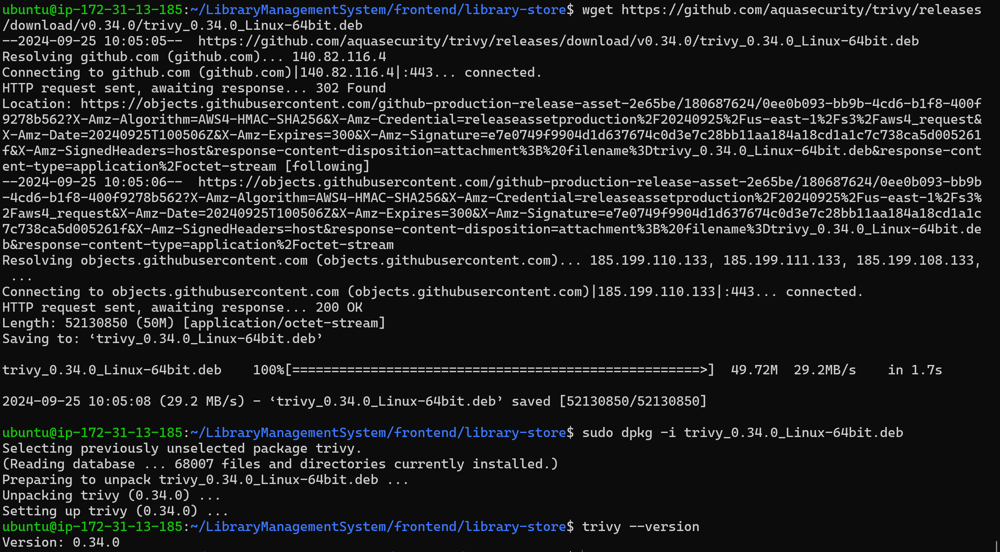

## frontend_image
* Run trivy scan for the image of frontend_image
* build image and run the trivy scan 
```sh
docker image build -t frontend_image:1.0 .
trivy image frontend_image:1.0
```
* After running trivy scan we get reports like that
* 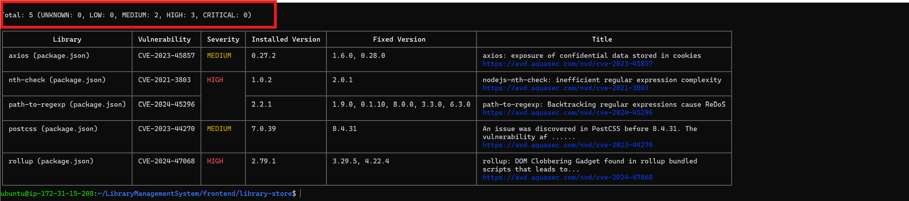
* Fix the issues by modifying Dockerfile 
  * Create the user `library` and run the application through that user
  * Run the working directory through `/library`
  * Run the Multi stage Dockerfile
* Make the necessary changes in Dockerfile as below
* 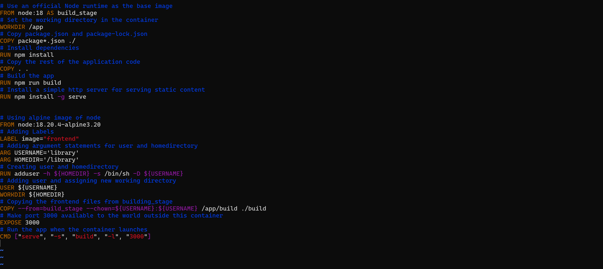
* After that see the results of trivy, issues got resolved after making those changes
* 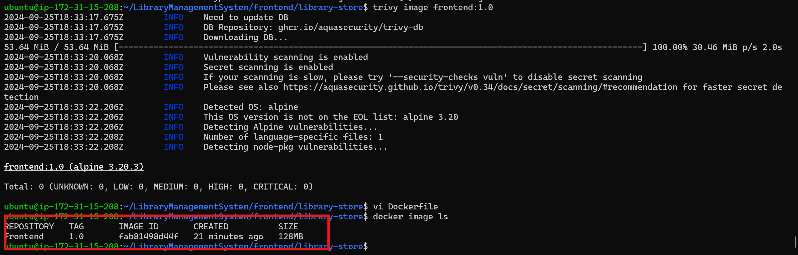
* Make sure that application is running inside the container and it is accessable
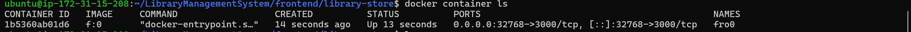


* Do trivy scan and see there is no issues in trivy reports
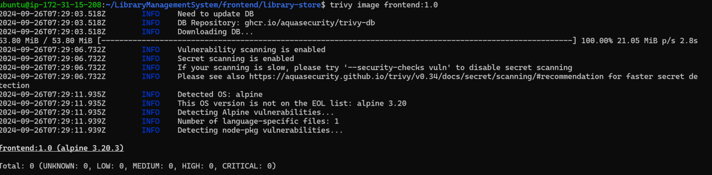
## Backend
* As mentioned earlier in backend we have two service
  * books 
  * users
### books
* First build the image for the backend books service
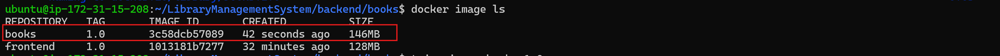
* Run trivy scan for image 
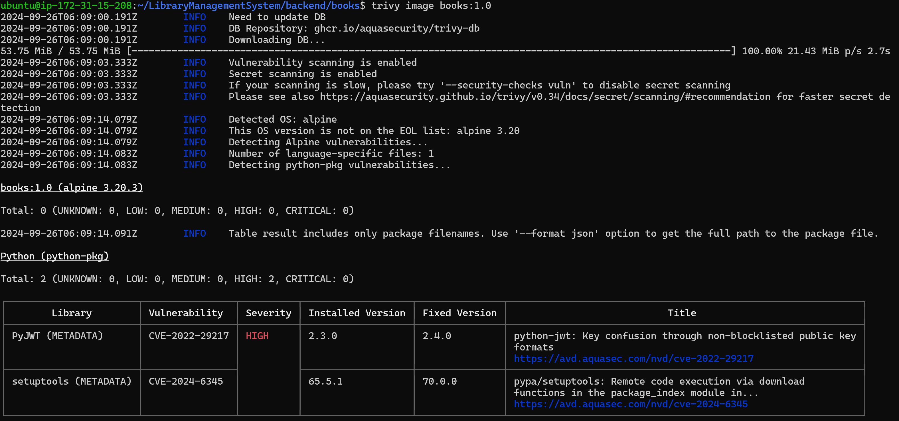
* Here two problems are there 
  * In the requirements section we have to change the version of `PyJWT` from `2.3.0 `  to `2.4.0 ` as done below
  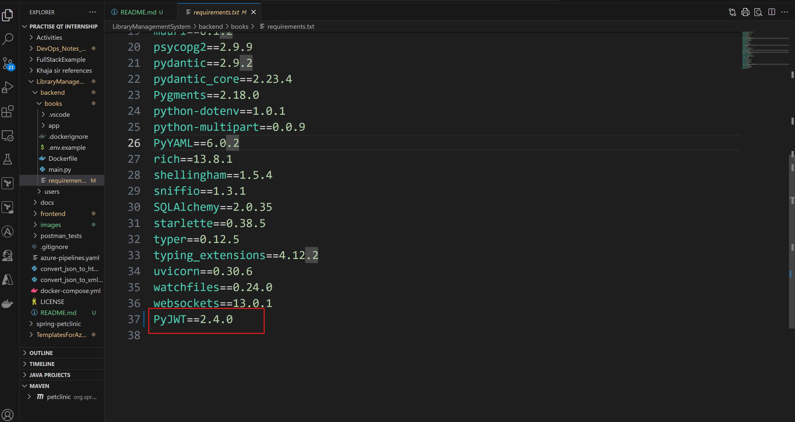
* Now run trivy scan issue got solved
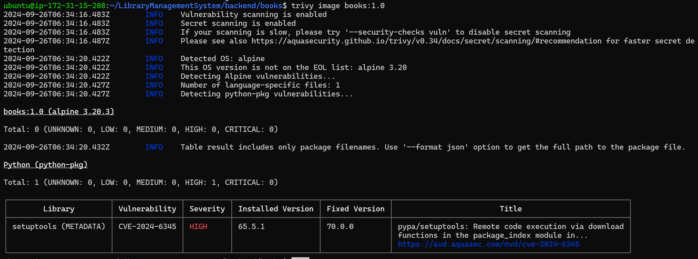
* To resolve the second trivy issue make change in Dockerfile as follows
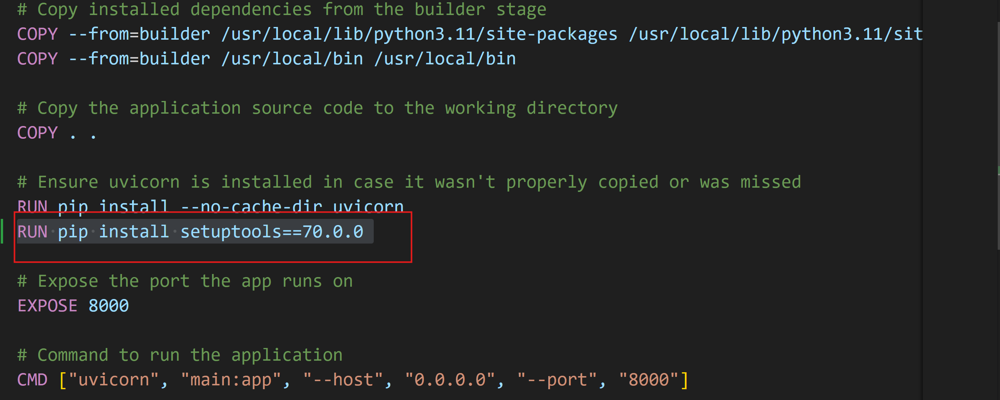
* Build image for modified Dockerfile and run trivy scan 
* you get that issues get resolved through it
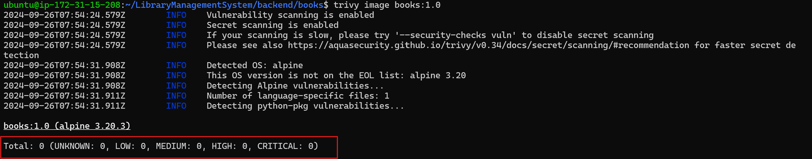
### users
* First build the docker image and run trivy scan for image
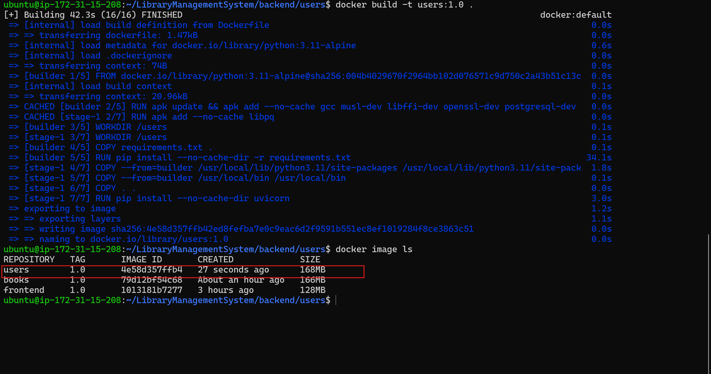
* Afer trivy scan you get errors like below
* 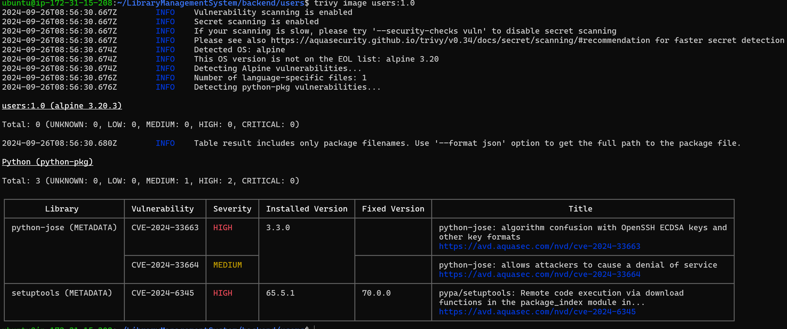
* To solve setuptools error we have to install 70.0.0 
* Add one instruction in the Dockerfile as below
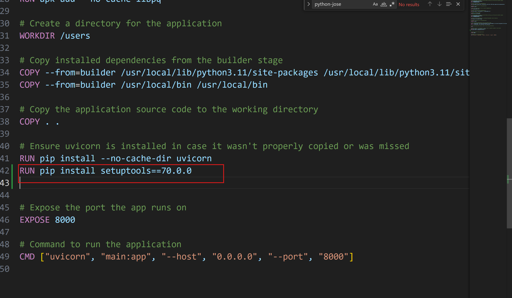
* Again build the image and run trivy scan
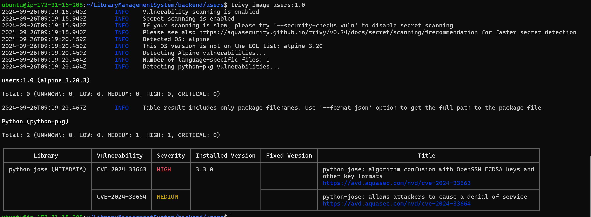
* As you see the issue with setuptool got resolved
* For the second issue possibly we don't have any fixed version to resolve the problem.
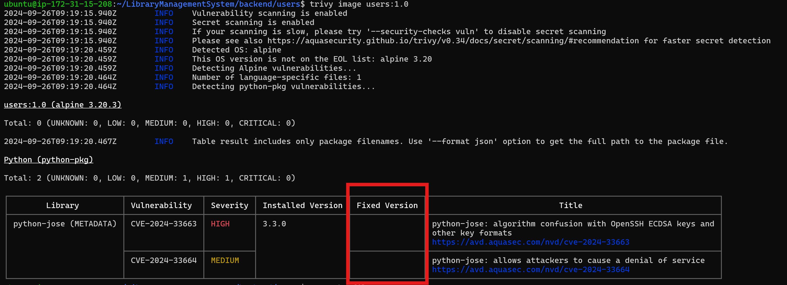