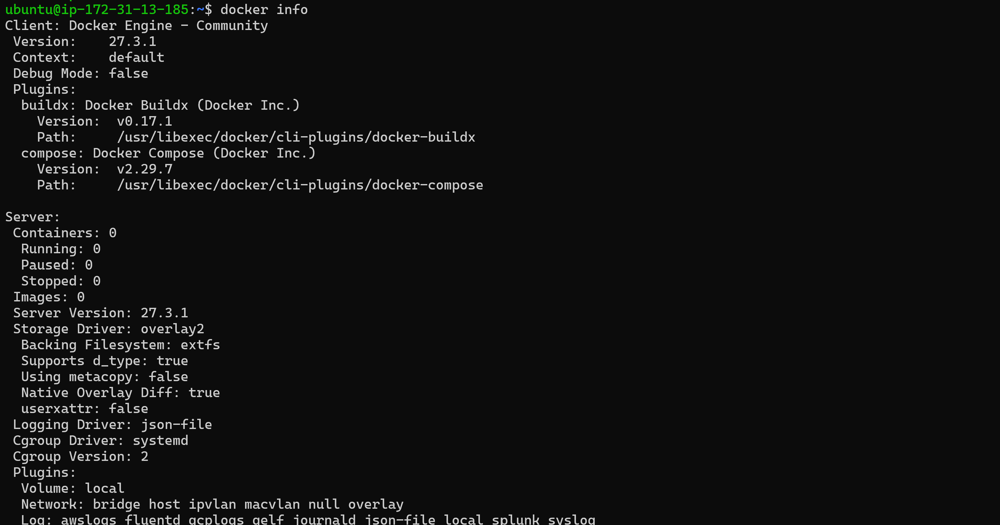
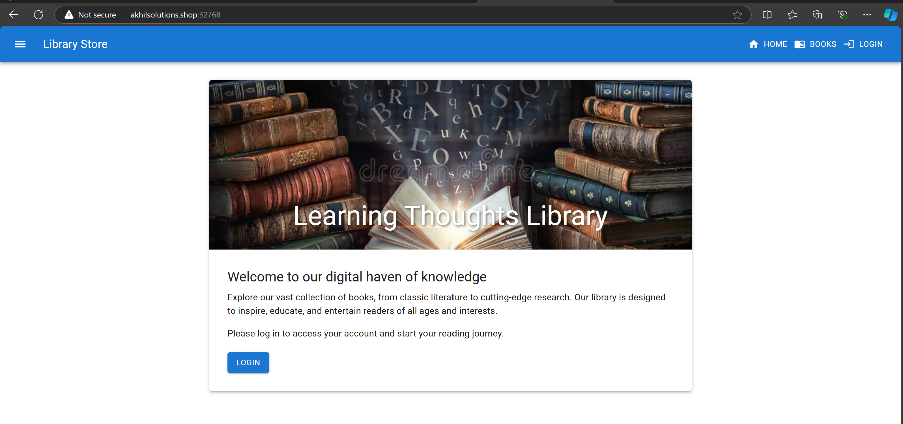
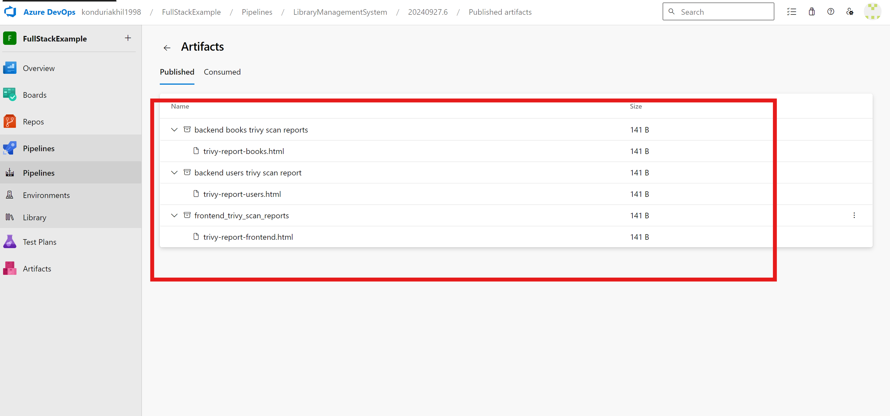

# LibraryManagementSystem
--------------------------
* In this project main we have to deal with three sections
  ## frontend_image
  ## backend
    * ### books
    * ### users
## What has to do?
* In this we have to do following things
  * build docker image
  * run trivy scan for docker image
  * publish trivy scan reports  
  * push the image to docker hub
* We have two approaches for doing this 
  * Manual 
  * Write azure pipeline
## Manual
* Clone git repository into the instance

### Install docker
```sh
curl -fsSL https://get.docker.com -o install-docker.sh
docker --version
```
* Add the user to docker group through following command
```  
sudo usermod -aG docker ubuntu
exit 
```
* 
* Clone the repository into your machine.

### Install Trivy
* Install trivy to scan docker images
* Execute the following commands 
```sh
sudo apt-get install -y wget
wget https://github.com/aquasecurity/trivy/releases/download/v0.34.0/trivy_0.34.0_Linux-64bit.deb
sudo dpkg -i trivy_0.34.0_Linux-64bit.deb
```
* 

## frontend_image
* Run trivy scan for the image of frontend_image
* build image and run the trivy scan 
```sh
docker image build -t frontend_image:1.0 .
trivy image frontend_image:1.0
```
* After running trivy scan we get reports like that
* 
* Fix the issues by modifying Dockerfile 
  * Create the user `library` and run the application through that user
  * Run the working directory through `/library`
  * Run the Multi stage Dockerfile
* Make the necessary changes in Dockerfile as below
* 
* After that see the results of trivy, issues got resolved after making those changes
* 
* Make sure that application is running inside the container and it is accessable



* Do trivy scan and see there is no issues in trivy reports

## Backend
* As mentioned earlier in backend we have two service
  * books 
  * users
### books
* First build the image for the backend books service

* Run trivy scan for image 

* Here two problems are there 
  * In the requirements section we have to change the version of `PyJWT` from `2.3.0 `  to `2.4.0 ` as done below
  
* Now run trivy scan issue got solved

* To resolve the second trivy issue make change in Dockerfile as follows

* Build image for modified Dockerfile and run trivy scan 
* you get that issues get resolved through it

### users
* First build the docker image and run trivy scan for image

* Afer trivy scan you get errors like below
* 
* To solve setuptools error we have to install 70.0.0 
* Add one instruction in the Dockerfile as below

* Again build the image and run trivy scan

* As you see the issue with setuptool got resolved
* For the second issue possibly we don't have any fixed version to resolve the problem.

# Azure Pipeline
* Write the CICD Azurepipeline to
  * Build docker image
  * Run trivy scan 
  * Publish Trivy scan reports
  * Push the image to docker hub
  * Write templates for each section of docker images
* Azure pipeline write down as follows

* Write Templates in other repository and call these templates in azure pipeline

```sh
parameters:
  - name: containerRegistry
    type: string
    default: docker-hub

stages:
  - stage: backend_books
    displayName: building backend books image, doing trivy scan, publishing trivy report and puhsing image to docker hub
    jobs:
      - job: backend_books
        steps:
          - task: Docker@2
            inputs:
              command: build
              Dockerfile: '$(Build.SourcesDirectory)/backend/books/Dockerfile'
              repository: konduri/librarybackend_books
              tags: $(tag)
            displayName: 'building docker image'

          - script: |
              sudo apt-get install -y wget
              wget https://github.com/aquasecurity/trivy/releases/download/v0.34.0/trivy_0.34.0_Linux-64bit.deb
              sudo dpkg -i trivy_0.34.0_Linux-64bit.deb
            displayName: 'Install Trivy'
          
          - task: CmdLine@2
            inputs:
              script: |
                trivy image --format json -o trivy-report.json konduri/librarybackend_books:$(tag) 
            displayName: 'Run trivy scan'
          
          - task: UsePythonVersion@0
            inputs:
              versionSpec: '3.x'
            displayName: 'Installing python'

          - task: Bash@3
            inputs:
              targetType: 'inline'
              script: |
                pip install jinja2
            displayName: 'Installing jinja2 for xml conversion of trivy reports'

          - task:  PythonScript@0
            inputs:
              scriptSource: 'inline'
              script: |
                import json
                from jinja2 import Template

                # Load the JSON data
                with open('trivy-report.json') as json_file:
                    data = json.load(json_file)

                # Define a simple HTML template
                html_template = """
                <html>
                <head>
                    <title>Trivy Report</title>
                </head>
                <body>
                    <h1>Trivy Vulnerability Report</h1>
                    <ul>
                    
                        <li>{{ vulnerability['VulnerabilityID'] }} - {{ vulnerability['Title'] }}</li>
                    
                    </ul>
                </body>
                </html>
                """

                # Create the HTML report
                template = Template(html_template)
                html_content = template.render(data=data)

                # Save the HTML output
                with open('trivy-report-books.html', 'w') as html_file:
                    html_file.write(html_content)
            displayName: 'converting trivy scan reports from json to xml'

          - task: PublishPipelineArtifact@1
            inputs:
              targetPath: 'trivy-report-books.html'
              artifactName: 'backend books trivy scan reports'
            displayName: 'Publishing trivy scan reports'
          
          - task: PublishTestResults@2
            inputs:
              testResultsFormat: JUnit
              testResultsFiles: '**/trivy-report-books.html'
          - task: Docker@2
            inputs:
              command: login
              containerRegistry: ${{ parameters.containerRegistry }}
            displayName: 'Log in to Docker-hub account'

          - task: Docker@2
            inputs:
              command: 'push'
              repository: konduri/librarybackend_books
              tags: |
                $(tag)
            displayName: 'push the docker image for backend'
```
```sh
parameters: 
  - name: containerRegistry
    type: string
    default: docker-hub

stages:
  - stage: backend_users
    displayName: building backend_users image, doing trivy scan, publishing trivy report and puhsing image to docker hub
    jobs:
      - job: backend_users
        steps:

          - task: Docker@2
            inputs:
              command: build
              Dockerfile: '$(Build.SourcesDirectory)/backend/users/Dockerfile'
              repository: konduri/librarybackend_users
              tags: $(tag)
            displayName: 'building docker image'

          - script: |
              sudo apt-get install -y wget
              wget https://github.com/aquasecurity/trivy/releases/download/v0.34.0/trivy_0.34.0_Linux-64bit.deb
              sudo dpkg -i trivy_0.34.0_Linux-64bit.deb
            displayName: 'Install Trivy'
          
          - task: CmdLine@2
            inputs:
              script: |
                trivy image --format json -o trivy-report.json konduri/librarybackend_users:$(tag) 
            displayName: 'Run trivy scan'
          
          - task: UsePythonVersion@0
            inputs:
              versionSpec: '3.x'
            displayName: 'Installing python'

          - task: Bash@3
            inputs:
              targetType: 'inline'
              script: |
                pip install jinja2
            displayName: 'Installing jinja2 for xml conversion of trivy reports'
          
          - task:  PythonScript@0
            inputs:
              scriptSource: 'inline'
              script: |
                import json
                from jinja2 import Template

                # Load the JSON data
                with open('trivy-report.json') as json_file:
                    data = json.load(json_file)

                # Define a simple HTML template
                html_template = """
                <html>
                <head>
                    <title>Trivy Report</title>
                </head>
                <body>
                    <h1>Trivy Vulnerability Report</h1>
                    <ul>
                    
                        <li>{{ vulnerability['VulnerabilityID'] }} - {{ vulnerability['Title'] }}</li>
                    
                    </ul>
                </body>
                </html>
                """

                # Create the HTML report
                template = Template(html_template)
                html_content = template.render(data=data)

                # Save the HTML output
                with open('trivy-report-users.html', 'w') as html_file:
                    html_file.write(html_content)
            displayName: 'converting trivy scan reports from json to xml'
 
          - task: PublishPipelineArtifact@1
            inputs:
              targetPath: 'trivy-report-users.html'
              artifactName: 'backend users trivy scan report'
            displayName: 'Publishing trivy scan reports'
          
          - task: PublishTestResults@2
            inputs:
              testResultsFormat: JUnit
              testResultsFiles: '**/trivy-report-users.html'
          - task: Docker@2
            inputs:
              command: login
              containerRegistry: ${{ parameters.containerRegistry }}
            displayName: 'Log in to Docker-hub account'

          - task: Docker@2
            inputs:
              command: 'push'
              repository: konduri/librarybackend_users
              tags: |
                $(tag)
            displayName: 'push the docker image for backend'
```
```sh
parameters: 
  - name: containerRegistry
    type: string
    default: docker-hub

stages:
  - stage: frontend
    displayName: building frontend image, doing trivy scan, publishing trivy report and puhsing image to docker hub
    jobs:
      - job: 'frontend'
        steps:

          - task: Docker@2
            inputs:
              command: build
              Dockerfile: '$(Build.SourcesDirectory)/frontend/library-store/Dockerfile'
              repository: konduri/libraryfrontend
              tags: $(tag)
            displayName: 'building docker image'

          - script: |
              sudo apt-get install -y wget
              wget https://github.com/aquasecurity/trivy/releases/download/v0.34.0/trivy_0.34.0_Linux-64bit.deb
              sudo dpkg -i trivy_0.34.0_Linux-64bit.deb
            displayName: 'Install Trivy'
          
          - task: CmdLine@2
            inputs:
              script: |
                trivy image --format json -o trivy-report.json konduri/libraryfrontend:$(tag) 
            displayName: 'Run trivy scan'
          
          - task: UsePythonVersion@0
            inputs:
              versionSpec: '3.x'
            displayName: 'Installing python'

          - task: Bash@3
            inputs:
              targetType: 'inline'
              script: |
                pip install jinja2
            displayName: 'Installing jinja2 for the conversion of images from json to xml'

          - task:  PythonScript@0
            inputs:
              scriptSource: 'inline'
              script: |
                import json
                from jinja2 import Template

                # Load the JSON data
                with open('trivy-report.json') as json_file:
                    data = json.load(json_file)

                # Define a simple HTML template
                html_template = """
                <html>
                <head>
                    <title>Trivy Report</title>
                </head>
                <body>
                    <h1>Trivy Vulnerability Report</h1>
                    <ul>
                    
                        <li>{{ vulnerability['VulnerabilityID'] }} - {{ vulnerability['Title'] }}</li>
                    
                    </ul>
                </body>
                </html>
                """

                # Create the HTML report
                template = Template(html_template)
                html_content = template.render(data=data)

                # Save the HTML output
                with open('trivy-report-frontend.html', 'w') as html_file:
                    html_file.write(html_content)
            displayName: 'converting trivy scan reports from json to xml'

          - task: PublishPipelineArtifact@1
            inputs:
              targetPath: 'trivy-report-frontend.html'
              artifactName: 'frontend_trivy_scan_reports'
            displayName: 'Publishing trivy scan reports'
          
          - task: PublishTestResults@2
            inputs:
              testResultsFormat: JUnit
              testResultsFiles: '**/trivy-report-frontend.html'
          - task: Docker@2
            inputs:
              command: login
              containerRegistry: ${{ parameters.containerRegistry }}
            displayName: 'Log in to Docker-hub account'

          - task: Docker@2
            inputs:
              command: 'push'
              repository: konduri/libraryfrontend
              tags: |
                $(tag)
            displayName: 'push the docker image for frontend'
```
* Run the pipeline 

* trivy-results are produced in html format


* Docker images are pushed into Docker-hub

